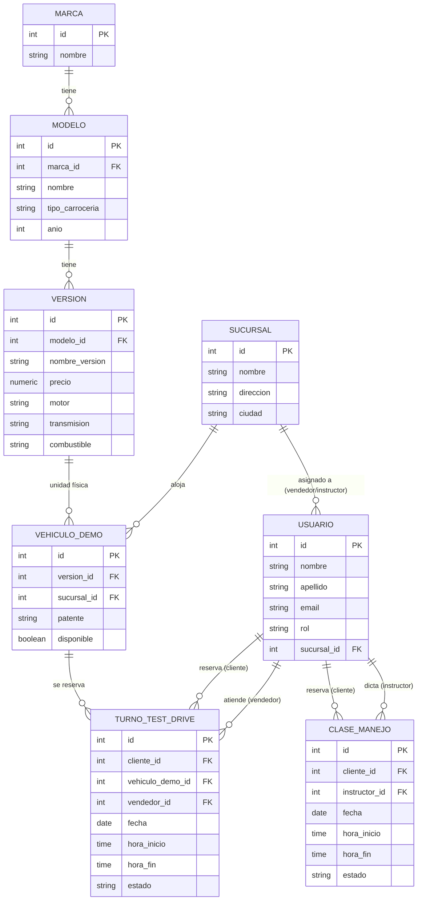

# Propuesta de Proyecto — Trabajo Final Integrador
## Portal Multimarca de Venta y Reserva de Test Drive

## Datos generales

| Campo | Detalle |
|---|---|
| **Nombre del proyecto** | Km0 Automotores |
| **Tipo de cliente** | Inventiva propia — sitio ficticio inspirado en portales oficiales de concesionarias multimarca (ej. Toyota Argentina, Autocity) |
| **Integrantes** | Agustín Hurtado, Valentín Gonzalez Puleo, Luciano Wittmund |
| **Tutor** | Sergio Andrés Antonini |
| **Repositorio GitHub** | https://github.com/AgusS05/km0-automotores |

---

## 1. Identificación de la problemática

### Contexto
Km0 Automotores es una concesionaria multimarca que vende autos 0km de distintas marcas (Toyota, Volkswagen, Audi, BMW, Chevrolet, entre otras). Aun vendiéndose todas desde un mismo lugar, la coordinación de un test drive suele depender de un llamado telefónico, WhatsApp o una visita presencial, sin un sistema online que muestre en tiempo real qué vehículos y horarios están disponibles. Si la concesionaria además ofrece un servicio de escuela de manejo, esa agenda suele gestionarse por separado, sin integración con el resto de la operación.

### Actores y necesidades

| Actor | Rol | Necesidad principal |
|---|---|---|
| Cliente / comprador | Explora catálogo y reserva turnos | Ver modelos de varias marcas y agendar un test drive sin llamar por teléfono |
| Vendedor | Gestiona turnos y stock de demo por marca | Ver la agenda consolidada y evitar turnos duplicados o superpuestos |
| Instructor de manejo | Dicta clases de manejo (módulo opcional) | Ver su propia agenda de clases asignadas |
| Administrador del sitio | Carga marcas, modelos y disponibilidad | Mantener el catálogo y los horarios disponibles actualizados |

### Impacto medible
- Tiempo perdido por el comprador coordinando turnos vía teléfono/WhatsApp con cada concesionaria por separado.
- Turnos duplicados o superpuestos por falta de una agenda centralizada.
- Pérdida de leads (potenciales compradores) por demora en la respuesta de contacto.

### Validación del problema
*Km0 Automotores, una concesionaria que vende autos 0km de varias marcas, actualmente coordina los test drives de forma manual —por teléfono, WhatsApp o visita presencial—, sin visibilidad en tiempo real de qué vehículos y horarios están disponibles, lo que genera demoras, turnos perdidos y clientes que abandonan el interés de compra. Además, si ofrece clases de manejo como servicio adicional, esa agenda se gestiona aparte, sin integración con el resto del sitio. Una plataforma web propia podría centralizar el catálogo de las marcas que vende, la reserva de turnos de test drive en tiempo real, y opcionalmente la reserva de clases de manejo, todo desde un único lugar.*

- ¿Está ocurriendo ahora? Sí, es la forma habitual en que operan hoy las concesionarias, incluso las que venden varias marcas desde un mismo local.
- ¿Los afectados reconocen el problema? Sí: la demora en coordinar un test drive por teléfono o WhatsApp es una fricción típica en la búsqueda de auto 0km, incluso dentro de una misma concesionaria.
- ¿Existe solución parcial? La concesionaria puede coordinar turnos manualmente o con formularios de contacto genéricos, pero no hay una agenda online integrada que muestre disponibilidad en tiempo real ni conecte el test drive con la escuela de manejo.

---

## 2. Propuesta de valor

**Para el cliente (comprador):**
- Reserva de test drive 100% online, viendo franjas horarias realmente disponibles, sin llamar ni esperar respuesta.
- Recordatorio automático (email) antes del turno, para reducir el olvido.
- Comparador simple entre los modelos de interés, sin recorrer fichas sueltas.

**Para la concesionaria:**
- Agenda centralizada por vendedor y vehículo demo, evitando turnos duplicados o superpuestos entre marcas.
- Panel con métricas: modelos con más pedidos de test drive, franjas horarias más demandadas, tasa de inasistencia (no-shows).
- Alertas automáticas cuando un turno está por vencer sin confirmar, para que el vendedor haga seguimiento antes de perder el lead.

No alcanza con digitalizar el mismo cuaderno de turnos en una web: el valor está en que la plataforma detecte patrones (qué se pide más, quién no confirma) y dispare alertas útiles tanto para el cliente como para el vendedor.

---

## 3. Alcance y funcionalidades principales

| Funcionalidad | Incluye | Estimación |
|---|---|---|
| Arquitectura base + diseño de BD | Setup de repo, esqueleto Spring Boot + React, modelo de datos en PostgreSQL | 2 semanas (hasta 27/09 — 2.ª entrega) |
| Catálogo de vehículos | CRUD de marcas y modelos, ficha con specs básicas e imágenes | 2 semanas |
| Reserva de test drive | Selección de vehículo, sucursal, fecha y horario disponible, validación de superposición | 2 semanas |
| Panel de administración | Carga de marcas/modelos/disponibilidad, vista de turnos | 1 semana |
| Valor agregado (dashboard + alertas) | Métricas de turnos, recordatorio automático, alertas de no confirmación | 1 semana |
| Escuela de manejo *(extensión, si el tiempo lo permite)* | Reserva de clases con instructor | 1 semana |
| Despliegue, documentación y video | Deploy online, informe final, video explicativo | 1 semana (hasta 14/11) |

**Fuera de alcance por ahora:** pasarela de pago o financiación, comparador avanzado tipo Autocity (ver punto 4).

---

## 4. Análisis de competencia

| | Quién | Qué ofrece hoy | Qué NO ofrece |
|---|---|---|---|
| **Directo — sitios de marca** | Toyota Argentina, Volkswagen Argentina, Ford Argentina, Mercedes-Benz Argentina | Formulario de "solicitar test drive" por modelo; después te contacta un vendedor | No es un turno confirmado en el momento: es un pedido de contacto, sin ver disponibilidad horaria real |
| **Directo — concesionaria multimarca** | Autocity (Córdoba y otras ciudades; agrupa Renault, Fiat, Nissan, Peugeot, Jeep, VW) | Comparador de hasta 3 autos, pista física de test drive, agenda de preturno para service | El test drive no se reserva online con horario propio; no integra escuela de manejo |
| **Indirecto — portales/clasificados** | MercadoLibre Autos, AutoCosmos, DeMotores | Listado y comparación de fichas técnicas de múltiples marcas y concesionarias | No gestionan turnos ni contacto directo con una concesionaria puntual |

**Diferenciadores de Km0 Automotores:**
- Reserva de test drive con horario real disponible y confirmación inmediata (no un formulario que deriva a un llamado, como en los sitios de marca).
- Escuela de manejo integrada a la misma plataforma y agenda: ninguno de los competidores relevados la ofrece junto con la venta.
- Panel de métricas para la concesionaria (no solo para el cliente), pensado para reducir no-shows y detectar qué modelos generan más interés real.

---

## 5. Stack tecnológico propuesto

| Componente | Tecnología | Justificación |
|---|---|---|
| Frontend | React + TypeScript (Vite) | Es el lenguaje/stack que más dominamos actualmente; permite construir una SPA con la sensación de sitio "de marca" con buena velocidad de desarrollo. |
| Backend | Spring Boot (Java) + Spring Data JPA | Es la tecnología que estamos cursando actualmente en la carrera, y ya tenemos experiencia previa con Java y JPA por el proyecto de Food Store de Programación III. |
| Base de datos | PostgreSQL | Los datos tienen estructura bien definida y estable (marcas, modelos, sucursales, turnos, usuarios) con relaciones importantes entre entidades (FK: turno→vehículo→cliente→sucursal), y se necesita integridad transaccional (ACID) para evitar que dos personas reserven el mismo horario. Se integra de forma nativa con Spring Data JPA/Hibernate. |
| Control de versiones | GitHub | Uso obligatorio según la cátedra; repositorio único centralizando todo el proyecto. |
| Gestión de proyecto | GitHub Projects | Tablero Kanban simple para trazabilidad del equipo. |
| Asistencia IA | GitHub Copilot / Claude | Para refactorización y unit testing; las decisiones de arquitectura y la lógica de negocio quedan a cargo del equipo. |

### Justificación general
Elegimos React + TypeScript para el frontend porque es la tecnología que mejor dominamos hoy. Para el backend elegimos Spring Boot porque es lo que estamos viendo en este momento en la cursada —lo que reduce el costo de aprendizaje real dentro de un cronograma ya ajustado por la situación de excepción en la materia— y porque ya tenemos experiencia previa con Java/JPA del proyecto de Food Store. Elegimos PostgreSQL en lugar de una base no relacional porque el dominio del problema —catálogo con relaciones fijas y turnos que no pueden superponerse— encaja mejor con un esquema relacional con integridad transaccional, según los propios criterios técnicos de la guía de la cátedra (estructura estable, relaciones entre entidades, necesidad de ACID); frente a MySQL, la diferencia práctica para este proyecto es mínima, pero Postgres se integra de forma más directa con Spring Data JPA/Hibernate.

---

## 6. Plataforma de despliegue

| Componente | Plataforma sugerida |
|---|---|
| Frontend | Vercel |
| Backend | Render o Railway (Spring Boot se despliega vía Docker o buildpack Java) |
| Base de datos PostgreSQL | Render, Railway, Neon o Supabase (planes gratuitos para entorno académico) |

---

## 7. Organización del repositorio

```
/frontend        → React + TypeScript
/backend         → Spring Boot + Spring Data JPA (Java)
/database        → scripts DDL/DML y diagrama ER
/docs            → informes y avances de entregas
README.md        → instrucciones de instalación, stack, integrantes
```

---

## 8. Esquema de la base de datos (Segunda Entrega)

Base de datos relacional en PostgreSQL. Diagrama entidad-relación:



### Descripción de entidades

| Entidad | Descripción |
|---|---|
| `marca` | Marcas que vende la concesionaria |
| `modelo` | Modelos de cada marca |
| `version` | Versión/trim específica de un modelo, con precio y ficha técnica |
| `sucursal` | Sucursales físicas de la concesionaria |
| `usuario` | Clientes, vendedores, administradores e instructores, diferenciados por `rol` |
| `vehiculo_demo` | Unidad física disponible para test drive, ligada a una versión y una sucursal |
| `turno_test_drive` | Reserva de test drive: cliente, vehículo demo, vendedor, fecha/horario y estado |
| `clase_manejo` | Reserva de clase de manejo con un instructor (módulo extensión) |

La restricción `UNIQUE (vehiculo_demo_id, fecha, hora_inicio)` sobre `turno_test_drive` (ver `database/schema.sql`) garantiza a nivel de base de datos que dos personas no puedan reservar el mismo auto en el mismo horario — el punto de integridad transaccional que justificó elegir PostgreSQL.

---

## 9. Listado de módulos a desarrollar (Segunda Entrega)

| # | Módulo | Qué hace | Entidades principales |
|---|---|---|---|
| 1 | Autenticación y usuarios | Registro/login, roles (cliente, vendedor, admin, instructor) | `usuario` |
| 2 | Catálogo | ABM de marcas, modelos y versiones; listado público con fichas | `marca`, `modelo`, `version` |
| 3 | Sucursales y stock demo | ABM de sucursales y de vehículos demo disponibles | `sucursal`, `vehiculo_demo` |
| 4 | Reserva de test drive | Selección de vehículo/horario, validación de superposición, cambio de estado del turno | `turno_test_drive` |
| 5 | Panel de administración | Vista consolidada de turnos y carga de disponibilidad para vendedores/admin | `turno_test_drive`, `usuario`, `vehiculo_demo` |
| 6 | Métricas y alertas (valor agregado) | Dashboard de turnos por modelo, tasa de no-shows, recordatorio automático | `turno_test_drive` |
| 7 | Escuela de manejo *(extensión)* | Reserva de clases con instructor, si el cronograma lo permite | `clase_manejo`, `usuario` |

---

## 10. Estado de aprobación

- [ ] Aprobado por el tutor (Sergio Andrés Antonini)
- [ ] Aprobado por el comité de trabajo final
