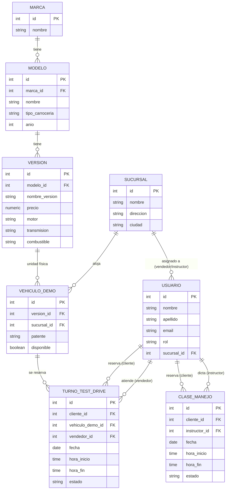

# Km0 Automotores — Esquema de Base de Datos y Módulos
## Segunda Entrega — Trabajo Final Integrador

## 1. Esquema de la base de datos (relacional — PostgreSQL)

### Diagrama entidad-relación

*(GitHub renderiza este diagrama automáticamente al ver el archivo en el repo.)*

### Descripción de entidades, campos y tipos de datos

| Entidad | Campos (tipo) | Clave primaria | Claves foráneas |
|---|---|---|---|
| `marca` | nombre (VARCHAR) | id | — |
| `modelo` | nombre (VARCHAR), tipo_carroceria (VARCHAR), anio (INTEGER) | id | marca_id → marca |
| `version` | nombre_version (VARCHAR), precio (NUMERIC), motor (VARCHAR), transmision (VARCHAR), combustible (VARCHAR) | id | modelo_id → modelo |
| `sucursal` | nombre (VARCHAR), direccion (VARCHAR), ciudad (VARCHAR) | id | — |
| `usuario` | nombre, apellido (VARCHAR), email (VARCHAR, único), password_hash (VARCHAR), rol (VARCHAR) | id | sucursal_id → sucursal |
| `vehiculo_demo` | patente (VARCHAR, único), disponible (BOOLEAN) | id | version_id → version, sucursal_id → sucursal |
| `turno_test_drive` | fecha (DATE), hora_inicio/hora_fin (TIME), estado (VARCHAR) | id | cliente_id → usuario, vehiculo_demo_id → vehiculo_demo, vendedor_id → usuario |
| `clase_manejo` | fecha (DATE), hora_inicio/hora_fin (TIME), estado (VARCHAR) | id | cliente_id → usuario, instructor_id → usuario |

### Restricciones de integridad e índices principales

- `UNIQUE (vehiculo_demo_id, fecha, hora_inicio)` en `turno_test_drive`: impide que dos clientes reserven el mismo auto en el mismo horario.
- `UNIQUE (instructor_id, fecha, hora_inicio)` en `clase_manejo`: impide que un instructor tenga dos clases superpuestas.
- `UNIQUE` en `usuario.email` y `vehiculo_demo.patente`.
- Índices sobre todas las columnas FK (`modelo.marca_id`, `version.modelo_id`, `vehiculo_demo.version_id`, `vehiculo_demo.sucursal_id`, `usuario.sucursal_id`, `turno_test_drive.cliente_id/vehiculo_demo_id/vendedor_id`, `clase_manejo.cliente_id/instructor_id`) e índice sobre `fecha` en ambas tablas de turnos, para acelerar las búsquedas de disponibilidad. Ver detalle completo en `database/schema.sql`.

---

## 2. Listado de módulos a desarrollar

| # | Módulo | Qué hace | Prioridad | Entidades principales |
|---|---|---|---|---|
| 1 | Autenticación y usuarios | Registro/login, roles (cliente, vendedor, admin, instructor) | Alta | `usuario` |
| 2 | Catálogo | ABM de marcas, modelos y versiones; listado público con fichas | Alta | `marca`, `modelo`, `version` |
| 3 | Sucursales y stock demo | ABM de sucursales y de vehículos demo disponibles | Alta | `sucursal`, `vehiculo_demo` |
| 4 | Reserva de test drive | Selección de vehículo/horario, validación de superposición, cambio de estado del turno | Alta | `turno_test_drive` |
| 5 | Panel de administración | Vista consolidada de turnos y carga de disponibilidad para vendedores/admin | Media | `turno_test_drive`, `usuario`, `vehiculo_demo` |
| 6 | Métricas y alertas (valor agregado) | Dashboard de turnos por modelo, tasa de no-shows, recordatorio automático | Media | `turno_test_drive` |
| 7 | Escuela de manejo *(extensión)* | Reserva de clases con instructor, si el cronograma lo permite | Baja | `clase_manejo`, `usuario` |

---

## 3. Estado de aprobación

- [ ] Aprobado por el tutor (Sergio Andrés Antonini)
- [ ] Aprobado por el comité de trabajo final
